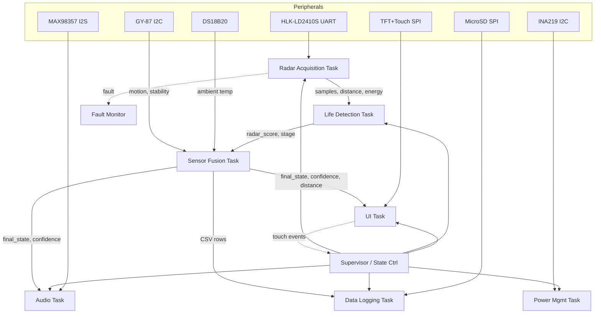
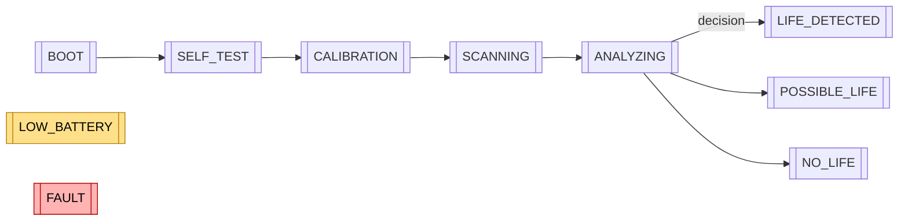
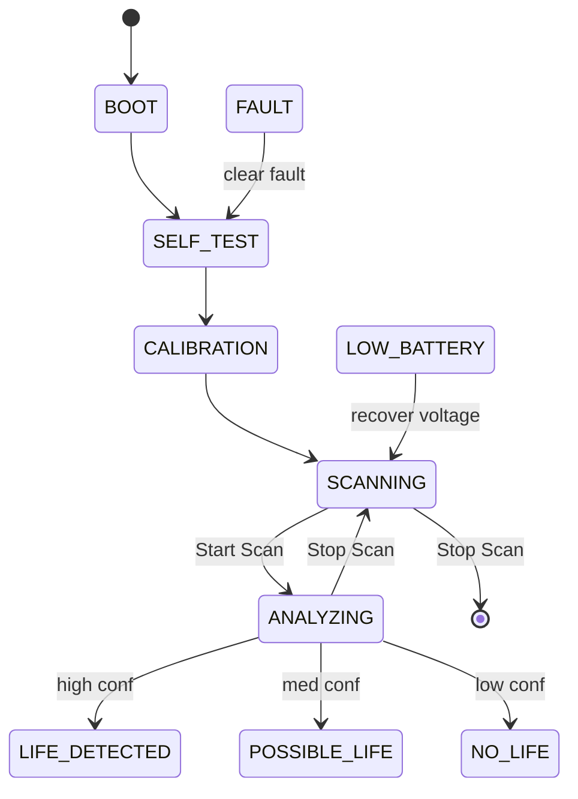

# RADAR_X — Radar-Based Living Person Detection (ESP32 + HLK-LD2410S)

## Overview
- Objective: Detect human presence beneath rubble by analyzing micro-movements (respiration, heartbeat) through a 24 GHz FMCW radar.
- Platform: ESP32-WROOM-32D, HLK‑LD2410S radar, 3.5″ SPI TFT (with touch), MAX98357 I2S amplifier + speaker, buzzer (optional), MicroSD, INA219, GY‑87 IMU, DS18B20.
- OS/SDK: ESP‑IDF with FreeRTOS. Modular tasks with clear inter-task messaging and fail-safe behavior.
- Key outputs: LIFE_CONFIRMED | POSSIBLE_LIFE | NO_LIFE | NOISE with confidence % and distance.

---

## Firmware Architecture
- Pattern: Producer/consumer tasks linked by queues, ring buffers, and event groups.
- Separation of concerns:
  - Radar acquisition parses UART frames and filters signals.
  - Life detection performs multi-stage signal analysis.
  - Sensor fusion integrates radar confidence with thermal and stability.
  - UI task renders state and charts; Audio task handles prompts/tones.
  - Data logging writes CSV entries; Power manager enforces low-battery policy.
  - Fault monitor detects peripheral failures and asserts FAULT state.



Intertask resources:
- Queues:
  - radar_q: filtered frames → life detection
  - decision_q: life detection → sensor fusion
  - ui_q: fused outputs → UI
  - audio_q: events → audio
  - log_q: CSV rows → logger
- Event group: system_state_eg (BOOT, SCANNING, ANALYZING, LIFE, POSSIBLE, NO_LIFE, LOW_BATTERY, FAULT)
- Ring buffer: radar_samples_rb for time windows

---

## RTOS Task Structure


- Radar Acquisition (core 0, high prio): UART RX/parse, filters (LPF + moving average), noise thresholding, micro-vibration isolation.
- Life Detection (core 1, high prio): Stage 1–5 classification and confidence.
- Sensor Fusion (core 1, medium): Weighted model; outputs final state and confidence.
- UI (core 0, medium): State machine, graphs, battery, logging indicator; processes touch.
- Audio (core 0, low): Voice prompt playback and tones over I2S.
- Data Logger (core 1, low): Batch write CSV, FAT wear-friendly.
- Power Manager (core 0, medium): INA219 sampling, brightness/audio throttling on low battery.
- Fault Monitor (core 1, medium): Timeouts, disconnects, overcurrent; asserts FAULT.
- Supervisor (core 0, high): Orchestrates transitions and handles calibration and scan modes (Rapid/Deep).

---

## Life Detection Algorithm (Pseudocode)
Stages:
1) Motion Detection
2) Micro-movement classification
3) Respiration periodicity detection
4) Heartbeat micro-signal estimation
5) Confidence scoring

```pseudo
input: radar_frames(t), imu_stability, temp_c
params:
  Fs = radar_sample_rate
  win_resp = 8 s sliding window
  win_heart = 5 s sliding window
  band_resp = 0.1–0.5 Hz (6–30 bpm)
  band_heart = 0.8–3.0 Hz (48–180 bpm)
  noise_floor_alpha = 0.01

# Pre-filter and de-noise
x = detrend(radar_frames)                  # remove DC drift
x = lpf(x, cutoff=5 Hz)                   # low-pass
x = moving_average(x, N=5)                # smooth
noise_floor = ema(|x|, alpha=noise_floor_alpha)
if mean(|x|) < k_noise * noise_floor:
    return NOISE with low confidence

# Stage 1 – Motion Detection
motion_energy = var(x over 1 s)
if motion_energy > gross_motion_thresh:
    stage = MOTION_PRESENT
else:
    stage = NO_GROSS_MOTION

# Stage 2 – Micro-movement classification
x_mm = bandpass(x, 0.05–5 Hz)
mm_energy = band_energy(x_mm)
if mm_energy < micro_thresh:
    return NO_LIFE, conf=low

# Stage 3 – Respiration periodicity
x_resp = bandpass(x, band_resp)
resp_psd = welch(x_resp, win=win_resp)
resp_f0 = peak_frequency(resp_psd)
resp_snr = peak_snr(resp_psd, resp_f0)
resp_valid = (6 <= bpm(resp_f0) <= 30) and (resp_snr > snr_resp_thresh)

# Stage 4 – Heartbeat estimation
x_heart = bandpass(x, band_heart)
heart_psd = welch(x_heart, win=win_heart)
heart_f0 = peak_frequency(heart_psd)
heart_snr = peak_snr(heart_psd, heart_f0)
heart_valid = (40 <= bpm(heart_f0) <= 140) and (heart_snr > snr_heart_thresh)

# Stage 5 – Confidence scoring
radar_score = w_resp*sigmoid(resp_snr) + w_heart*sigmoid(heart_snr) + w_mm*norm(mm_energy)
if resp_valid and heart_valid and radar_score > T_life:
    state = LIFE_CONFIRMED
elif resp_valid and radar_score > T_possible:
    state = POSSIBLE_LIFE
else:
    state = NO_LIFE

# Distance estimation
distance = ld2410s_reported_distance_or_strength_estimate()

output: state, radar_score, distance, {resp_bpm, heart_bpm}
```

Recommended start weights: w_resp=0.6, w_heart=0.3, w_mm=0.1; thresholds tuned empirically.

### Adaptive Clutter Rejection
- Calibrate baseline at boot and when operator requests “Calibrate”.
- Maintain a robust baseline model using running median or EMA per range-bin and subtract it from incoming samples.
- Apply spectral subtraction in low-frequency bands to suppress stationary clutter while preserving periodic components.
- Gate adaptation with IMU: pause baseline update when handheld motion exceeds threshold to avoid contaminating baseline.
- Detect and notch persistent narrowband interferers with adaptive notches.

Pseudocode insert (pre-filter step):
```pseudo
# Adaptive baseline per-bin
baseline = ema(baseline, x, alpha_b) when imu_stability > S_thresh
x_clutter_rejected = x - baseline
x = x_clutter_rejected
```

---

## Sensor Fusion
- Stability score from IMU (lower motion → higher score).
- Thermal score from DS18B20 (human-compatible temperature proximity).
- Final confidence:

```
FinalConfidence = 0.6 × RadarScore + 0.2 × ThermalScore + 0.2 × StabilityScore
```

Scale each score to [0,1] before fusion.

### Multi-Scan Confidence Accumulation
- Aggregate decisions across sequential scans to improve robustness.
- Maintain an accumulator with exponential decay over time:
```
AccConf(t) = λ · AccConf(t-1) + (1-λ) · FinalConfidence_scan
```
  - Choose λ ≈ 0.6–0.8 depending on scan cadence.
- Promote state if AccConf crosses LIFE/POSSIBLE thresholds; demote with decay when no evidence persists.
- Log per-scan and accumulated confidence; display both on UI.
- Supervisor exposes Rapid (5 s) and Deep (20 s) scan modes that define window lengths for respiration/heartbeat PSD and accumulation cadence.

---

## UI State Machine
States:
- BOOT → SELF_TEST → CALIBRATION → SCANNING → ANALYZING → {LIFE_DETECTED | POSSIBLE_LIFE | NO_LIFE}
- LOW_BATTERY and FAULT can preempt from any state.



UI requirements:
- Real-time waveform (resp/heart bands), signal strength graph, distance indicator.
- Confidence % with animated radial meter; color-coded background:
  - Green = LIFE_DETECTED
  - Yellow = POSSIBLE_LIFE
  - Red = NO_LIFE
  - Blue = SCANNING
- Touch: Start/Stop Scan, View Logs, Calibrate, Toggle Silent, Select Scan Mode (Rapid/Deep).
- Battery and logging indicators; FAULT banner on errors.
- Detection heatmap mini-view: show range-bin energy vs time as a compact strip to aid repositioning.
- Reposition hint: on low AccConf but near-threshold radar_score, suggest “move 0.5–1 m” or “change angle” based on heatmap gradients.

---

## Audio Feedback
- Voice prompts: “Scanning initiated”, “Life detected”, “Possible life detected”, “No life detected”, “Battery low”.
- Tones (I2S or buzzer):
  - High pitch pulse → Life confirmed
  - Medium pulse → Possible
  - Long low tone → No life
- Store WAV prompts on MicroSD; stream via I2S to MAX98357.
- Tactical silent mode: mutes all voice/tones; UI and LEDs communicate states. Auto-enforce in LOW_BATTERY if configured.

---

## Data Logging (CSV)
Columns:
- timestamp_ms, scan_id, scan_mode, distance_m, signal_energy, resp_bpm, heart_bpm, radar_score, thermal_score, stability_score, final_confidence, acc_confidence, final_state, silent_mode

Behavior:
- Flush in batches to reduce wear. Date-rotated files (RADAR_YYYYMMDD.csv).

---

## Power Management
- Sample INA219 for voltage/current; estimate remaining capacity.
- If voltage < threshold:
  - Enter LOW_BATTERY state
  - Reduce TFT brightness
  - Disable speaker (tones off, voice prompts off) or force Tactical silent mode
- Overcurrent triggers FAULT and safe-downscale.

---

## Fault Detection
- Radar UART timeout or malformed frames → FAULT.
- SD mount/write errors → FAULT + disable logging.
- Sensor timeouts (IMU, DS18B20) → warn; escalate to FAULT if persistent.
- Overcurrent from INA219 → FAULT.
- UI displays fault with details; audio: single long low tone.

---

## ESP32 Pin Mapping (Proposed)
Note: Choose a single SPI bus (VSPI) for TFT, Touch, and MicroSD with distinct CS lines.

| Function            | ESP32 Pin | Notes                                  |
|---------------------|-----------|----------------------------------------|
| Radar UART2 RX      | GPIO16    | From LD2410S TX                        |
| Radar UART2 TX      | GPIO17    | To LD2410S RX                          |
| I2C SDA             | GPIO21    | INA219, GY-87                          |
| I2C SCL             | GPIO22    | INA219, GY-87                          |
| SPI SCLK (VSPI)     | GPIO18    | TFT/Touch/SD                           |
| SPI MOSI (VSPI)     | GPIO23    | TFT/Touch/SD                           |
| SPI MISO (VSPI)     | GPIO19    | TFT/Touch/SD                           |
| TFT CS              | GPIO5     |                                        |
| TFT D/C             | GPIO2     | Avoid pull-ups during boot             |
| TFT RST             | GPIO4     | Tie high if module has auto-reset      |
| TFT BL (PWM)        | GPIO27    | LEDC for brightness                    |
| Touch CS            | GPIO33    | XPT2046                                |
| Touch IRQ           | GPIO36    | Input-only                             |
| SD Card CS          | GPIO13    | MicroSD on same VSPI                   |
| I2S BCLK            | GPIO26    | MAX98357                               |
| I2S LRCLK           | GPIO25    | MAX98357                               |
| I2S DIN             | GPIO32    | MAX98357                               |
| DS18B20 (1‑Wire)    | GPIO14    | 4.7 kΩ pull-up to 3.3 V                |
| Buzzer (optional)   | GPIO15    | Use via transistor, mind boot straps   |
| Status RGB LED      | GPIO12    | With resistor, beware boot strap       |

Hardware notes:
- LD2410S typically powered at 5 V with 3.3 V UART logic; verify your module revision.
- Avoid strong pull-ups on strap pins (GPIO0/2/12/15) during boot.
- If the TFT module requires 5 V, ensure level-shifted inputs; many shields already include this.

---

## Power Wiring Diagram (Concept)
```mermaid
flowchart TB
    BATT[2×18650 (2S)] --> BMS[2S 10A BMS]
    BMS --> CHG[2S 8.4V Type‑C Charger]
    BMS --> BUCK[LM2596 Buck -> 5V]
    BUCK --> ESP[ESP32 Dev VIN/5V]
    BUCK --> RAD[HLK‑LD2410S 5V]
    BUCK --> TFT[TFT Module 5V]
    BUCK --> AMP[MAX98357 5V]
    ESP --> V33[3.3V Regulator]
    V33 --> I2C1[INA219, GY‑87, DS18B20]
    BUCK -.-> LED[RGB LED & Panel LED (with resistors)]
```

Guidelines:
- Set LM2596 to a stable 5.0 V; ensure adequate decoupling near each module.
- Use a 3.3 V rail for I2C sensors and logic-level devices as required.
- Route speaker power separately to reduce noise coupling.

---

## Simulation Mode (No Radar Connected)
Goal: Demonstrate UI, logging, and audio without hardware.

Approach:
- Build-time flag SIM_MODE enables synthetic radar frames in Radar Acquisition Task.
- Fake waveform generator:
  - Respiration: A·sin(2π·f_resp·t), f_resp ∈ [0.2–0.35] Hz with slight drift.
  - Heartbeat: Sum of small spikes at ~1.2–1.6 Hz.
  - Add pink/white noise; gate with stability score to simulate motion artifacts.
- Correlate UI graphs and confidence meter with generated values.
- Generate synthetic heatmap (range-bin energies) consistent with the waveform to drive the mini-view.
- Provide simulated Rapid/Deep scans and synthetic AccConf evolution for demo.

Example (pseudocode):
```c
#if SIM_MODE
float t = 0;
for (;;) {
  float resp = 0.8f * sinf(2 * PI * 0.28f * t);
  float heart = 0.15f * sinf(2 * PI * 1.3f * t) + 0.05f * sinf(2 * PI * 2.6f * t);
  float noise = 0.05f * randn();
  float x = resp + heart + noise;
  push_radar_sample(x);
  t += 1.0f / Fs;
  vTaskDelay(pdMS_TO_TICKS(1000 / Fs));
}
#endif
```

Confidence animation:
- Map FinalConfidence to a radial progress ring with easing.
- Animate color transitions per state (blue→yellow→green).

---

## Deployment Checklist
- Tooling:
  - ESP‑IDF installed; set IDF_TARGET=esp32; select correct COM.
  - Format MicroSD (FAT32), create /logs and /audio for WAV prompts.
- Electrical:
  - Verify buck output 5.0 V; check polarity on all modules.
  - Confirm LD2410S UART levels and supply; wire per pin map.
  - Ensure strap pins have safe boot levels.
- Firmware:
  - Build with/without SIM_MODE; run self-test; verify tasks start.
  - Run boot CALIBRATION to capture clutter baseline; repeat if scene changes.
  - Calibrate IMU stability baseline in a quiet environment.
  - Set voltage thresholds for LOW_BATTERY per pack characteristics.
- Validation:
  - SD logging file creation and CSV headers present.
  - Audio playback levels correct; no clipping or brownouts.
  - UI touch controls responsive; confidence meter and AccConf match scenarios.
  - Heatmap mini-view reacts to simulated/radar energy; reposition hints appear under weak conditions.
  - Verify Rapid (5 s) and Deep (20 s) scan behaviors and thresholds.
- Safety:
  - Enclosure clearances for radar aperture; speaker grill unobstructed.
  - Adequate ventilation for buck and amplifier.

---

## Technical Notes for Judges
- Detects life within ~6–10 m (theoretical, radar-limited). Practical range depends on debris density.
- Decision time: < 10 s per scan with overlapping windows for responsiveness.
- Low light/high noise compatible due to non-visual sensing and IMU-based stability compensation.
- Architecture modularity facilitates unit testing and SIM_MODE demos without hardware.

---

## CSV Example
```
timestamp_ms,scan_id,scan_mode,distance_m,signal_energy,resp_bpm,heart_bpm,radar_score,thermal_score,stability_score,final_confidence,acc_confidence,final_state,silent_mode
123456,7,RAPID,3.2,0.41,16,78,0.72,0.55,0.83,0.70,0.68,LIFE_CONFIRMED,false
```

